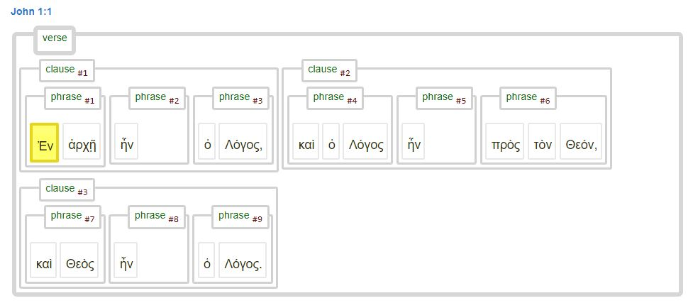
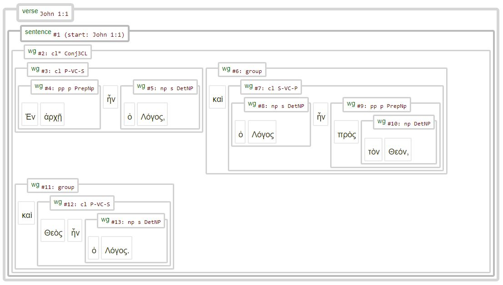

# About this dataset

This repository is part of a set of repositories dedicated to storing the code and data generated for the 'Nestle 1904 Text-Fabric conversion project'. One of the objectives of this project is to create a high-quality Text-Fabric presentation of the Treebank Nestle 1904 Greek New Testament, resembling the Text-Fabric implementation of the Hebrew Old Testament ([BHSA](https://github.com/ETCBC/bhsa)). The project is a collaboration between [ETCBC](https://github.com/ETCBC) (Vrije Universiteit Amsterdam) and [CBLC](https://github.com/CenterBLC) (Andrews University). 

The project project various TextFabric presentations of the Nestle 1904 Greek New Testament, including:
* Nestle 1904 (GBI nodes): [`Webpage`](https://tonyjurg.github.io/Nestle1904GBI/) [`Github`](https://github.com/tonyjurg/Nestle1904GBI)
* Nestle 1904 (LFT nodes): [`Webpage`](https://tonyjurg.github.io/Nestle1904LFT/) [`Github`](https://github.com/tonyjurg/Nestle1904LFT)
* Nestle 1904 (test version for final product): [`Github`](https://github.com/saulocantanhede/tfgreek2)
* Nestle 1904 (ETCBC version; planned): [`Github`](https://github.com/ETCBC/nestle1904)

Each version utilizes a different conversion method and/or employs different sourcedata, resulting in a distinct set of features that have been tailored to its specific intended use.

## Differences between datasets

Each of these Text-Fabric implementations has distinct features and was created differently. The fundamental differences are in the following areas:
Starting data (XML input data):
* [‘GBI nodes’]( https://github.com/tonyjurg/Nestle1904GBI/tree/main/resources/sourcedata)
*	[‘Low Fat Tree’]( https://github.com/tonyjurg/Nestle1904LFT/tree/main/resources/xml)

Production tools used to perform the conversion to Text-Fabric:
*	Module [tf.convert.walker](https://annotation.github.io/text-fabric/tf/convert/walker.html#tf.convert.walker) with dedicated director function).
*	Module [tf.convert.xml(https://annotation.github.io/text-fabric/tf/convert/xml.html#tf.convert.xml)].

Level of syntactical information:
*	‘Basic implementation’: limited syntactical information (e.g., ‘subject’, ‘object’).
*	'Full implementation': all available syntactical information.

Method of handling syntactic information (as present in the LowFatTree data):
*	‘as found’ presentation of wordgroups (lacks ‘clause’ and ‘phrase’ nodes).
*	'Interpretation' by adding clauses and phrases.

The Text-Fabric datasets vary in terms of the included syntactical information, which is evident when comparing their presentation of text, grammar, and syntax. Below are two images depicting the graphical representation of John 1:1.

## The Nestle1904GBI implementation

## The Nestle1904LFT implementation

