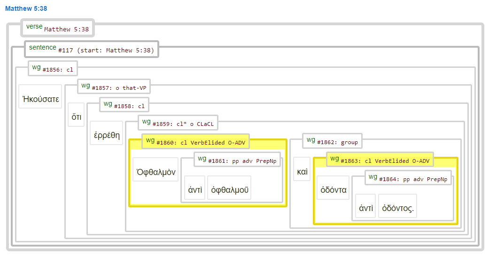

# Feature: clausetype 

Feature group | Feature type | Data type | Available for node types | Feature status
---  | --- | --- | --- | ---
[`Syntactic`](featuresbygroup.md#syntactic-features) | [`Node`](featuresbyfeaturetype.md#node-features) | [`string`](featuresbydatatype.md#string-datatype) | [`wg`](featuresbynodetype.md#wordgroup-nodes) | [✅](featuresbystatus.md#Trustworthy "Trustworthy")

## Feature description

Clause type information. The content of this feature (when pressent) is included in wordgroup label. 

## Feature values

Value | Description | Frequency
--- | --- | ---
` `	 | Clause (Verbal): expresses a proposition and contains verbal element as constituent | 102662
`VerbElided` | Verb Elided Clause: contains no verbal function (implied or carried over) | 1009
`Verbless` | Verbless Clause: relational clause without explicit verbal colula | 929
`Minor`	| Minor Clause: without any predication |  830

## Notes

The following image shows an example of two `VerbElided` clauses, showing the absence of a verb:

## Additional information

Description based upon:
> Andi Wu and Randall K. Tan, *Cascadia Syntax Graphs of the New Testament: Glossary* (Lexham 
Press, 2009).

## Source description
Taken from (optional) XML attribute `????` of tag `wg` (wordgroup).

---
###### *Browse all features by [node type](featuresbynodetype.md#start), [feature group](featuresbygroup.md#start), [data type](featuresbydatatype.md#start)  or [feature type](featuresbyfeaturetype.md#start).*
