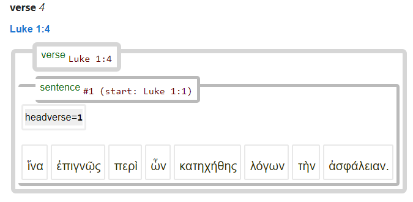

# Feature: headverse 

Feature group | Feature type | Data type | Available for node types | Feature status
---  | --- | --- | --- | ---
[`Sectional`](featuresbygroup.md#sectional-features) | [`Node`](featuresbyfeaturetype.md#node-features) | [`integer`](featuresbydatatype.md#integer-datatype) | [`sentence`](featuresbynodetype.md#sentence-nodes) | [✅](featuresbystatus.md#Trustworthy "Trustworthy")

## Feature description

Starting location of a sentence (verse number in current chapter).

## Notes

The content of this feature is also used in the label of a syntax tree to display the verse where the shown sentence started:

## Source description

Calculated from XML attribute `ref` of tag `w` (word) belonging to first word in the sentence.

---
###### *Browse all features by [node type](featuresbynodetype.md#start), [feature group](featuresbygroup.md#start), [data type](featuresbydatatype.md#start)  or [feature type](featuresbyfeaturetype.md#start).*
