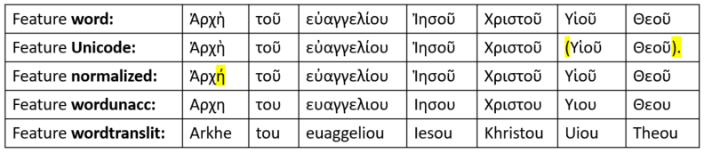

# Feature: unicode 

Feature group | Feature type | Data type | Available for node types | Feature status
---  | --- | --- | --- | ---
[`Orthographic`](featuresbygroup.md#orthographic-features) | [`Node`](featuresbyfeaturetype.md#node-features) | [`string`](featuresbydatatype.md#string-datatype)  | [`word`](featuresbynodetype.md#word-nodes) | [✅](featuresbystatus.md#Trustworthy "Trustworthy")

## Feature description 

The word as it appears in the text (formated in unicode). 

## Notes

See also the following related features:
   * [normalized](normalized.md#start): Surface word stripped of punctations	
   * [word](word.md#start): Word as it appears in the text
   * [wordtranslit](wordtranslit.md#start): Word transliterated to Latin characters	
   * [wordunacc](wordunacc.md#start): Word without accents

The following table will show the difference between these features using Mark 1:1 as example:

See this [jupyter notebook](https://nbviewer.org/github/tonyjurg/Nestle1904LFT/blob/main/docs/usecases/various_text_formats.ipynb#bullet3x2) for usage examples.

## Source description

Taken from attribute `unicode` from tag `w`.

---
###### *Browse all features by [node type](featuresbynodetype.md#start), [feature group](featuresbygroup.md#start), [data type](featuresbydatatype.md#start)  or [feature type](featuresbyfeaturetype.md#start).*
