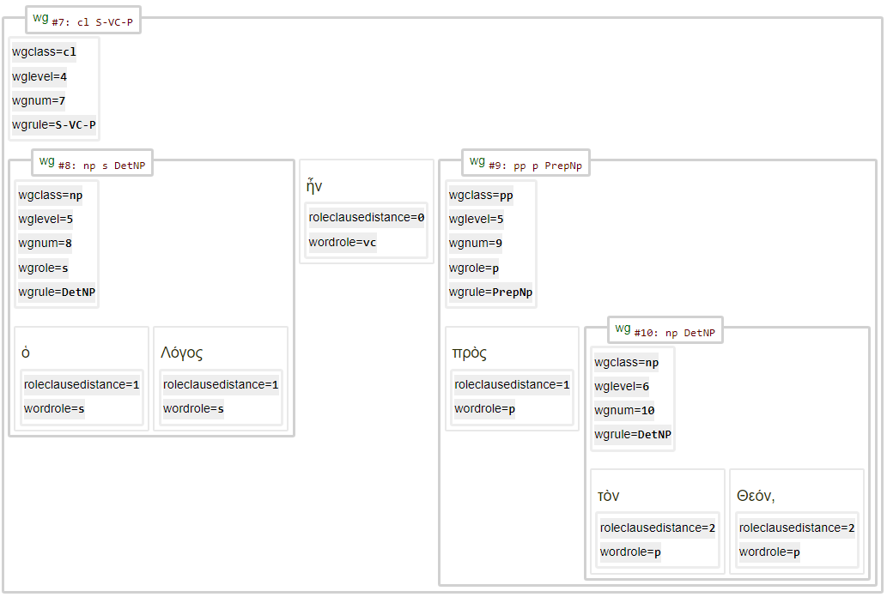

# Feature: wgrole 

Feature group | Feature type | Data type | Available for node types | Feature status
---  | --- | --- | --- | ---
[`Syntactic`](featuresbygroup.md#syntactic-features) | [`Node`](featuresbyfeaturetype.md#node-features) | [`string`](featuresbydatatype.md#string-datatype)  | [`wg`](featuresbynodetype.md#word-group-nodes) | [✅](featuresbystatus.md#Trustworthy "Trustworthy")

## Feature description 

Syntactical role of the wordgroup (abbreviated).

## Feature values

Value (this feature) | Description (feature [wgrolelong](wgrolelong.md#start)) | Frequency
--- |  --- | ---
adv | Adverbial | 16710
o | Object | 9329
s | Subject | 6710
p | Predicate | 1770
io | Indirect Object | 702
v | Verbal |405
aux | Auxiliar | 360
o2 | Second Object | 171
vc | Verbal Copula | 10
`ellipsis` || 2
`err_clause-complex-met-no-conditionsClCl2` || 1
`tail` || 1

## Notes

See also the following related features:
   * [wgrule](wgrule.md#start): Class of the wordgroup.
   * [wgclass](wgclass.md#start): All material found before a word.
   * [wordrole](wordrole.md#start): Syntactical role of the word (abbreviated).
   * [wgrole](wgrole.md#start): Syntactical role of the word (abbreviated).
   * [wglevel](wglevel.md#start): Number of the parent wordgroups for a wordgroup.
   * [roleclausedistance](roleclausedistance.md#start): Distance to wordgroup defining the role of this word.

The following image (part of the syntax tree of John 1 verse 1) demonstrates their relationship:

See also this [Jupyter notebook](https://nbviewer.org/github/tonyjurg/Nestle1904LFT/blob/main/docs/usecases/relation_clause_wg_word.ipynb) for more details.

## Source description

Taken from (optional) XML attribute `role` of tag `wg` (wordgroup).

---
###### *Browse all features by [node type](featuresbynodetype.md#start), [feature group](featuresbygroup.md#start), [data type](featuresbydatatype.md#start)  or [feature type](featuresbyfeaturetype.md#start).*

