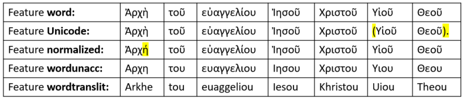

# Feature: wordtranslit 

Feature group | Feature type | Data type | Available for node types | Feature status
---  | --- | --- | --- | ---
[`Orthographic`](featuresbygroup.md#orthographic-features) | [`Node`](featuresbyfeaturetype.md#node-features) | [`string`](featuresbydatatype.md#string-datatype)  | [`word`](featuresbynodetype.md#word-nodes) | ✅

## Feature description

Transliterated Greek text (changed Greek letters into their Latin equivalent). 

## Note

See also the following related features:
   * [normalized](normalized.md#start): Surface word stripped of punctations	
   * [unicode](unicode.md#start): Word as it appears in the text (in unicode)
   * [word](word.md#start): Word as it appears in the text
   * [wordunacc](wordunacc.md#start): Word without accents

The following table will show the difference between these features using Mark 1:1 as example:

Use the option `fmt='text-transliterated'` to print results in transliterated format. Following example will print Mark 1:1 in transliterated format:

<pre>
T.text(139200,fmt='text-transliterated')
Arkhe tou euaggeliou Iesou Khristou Uiou Theou. 
</pre>

See this [jupyter notebook](https://nbviewer.org/github/tonyjurg/Nestle1904LFT/blob/main/docs/usecases/various_text_formats.ipynb#bullet3x2) for usage examples.

## Source description

Calculated from XML attribute `unicode` of tag `w` (word).

---
###### *Browse all features by [node type](featuresbynodetype.md#start), [feature group](featuresbygroup.md#start), [data type](featuresbydatatype.md#start)  or [feature type](featuresbyfeaturetype.md#start).*
